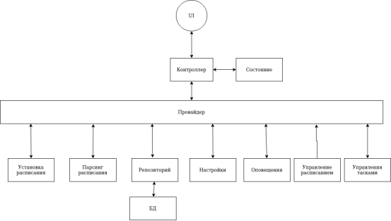

# ScheduleMIREA

## О приложении

Это приложение для студентов МИРЭА, которое поможет в отслеживании расписания и заданий на семестр

Для того чтобы подробнее просмотреть возможности приложения, можете пройти на [руководство
пользователя](https://schedulemirea.fandom.com/ru/wiki/ScheduleMIREA_%D0%92%D0%B8%D0%BA%D0%B8)

## О структуре приложения

### Описание архитектуры
Данное приложение было решено реализовать на Flutter, так как приложение должно быть кроссплатформенным, а релизовывать все нативно слишком трудозатратно.
Приложение состоит из маленьких модулей, которые отвечают за одну функцию. Модули обасоблены, что позволяет их контролировать и тестировать.

* Модуль установки расписания. Данный модуль устанавливает файл расписания с сайта на основе введенной группы.
* Модуль парсинга расписания. Модуль парсит файл формата xlsx и предоставляет модельку данных расписания для определенной группы.
* БД. Приложение имеет локальную базу данных. База данных хранит расписание и тикеты для определенной шруппы. Доступ к БД можно получить только через модуль управления БД. Само БД реализуется на SQLite, так как у нас мобильное приложение и возможностей этой базы данных нам должно хватить.
* Модуль настроек. В данном модуле хранятся данные настроек. Для реализации хранения настроек используется пакет «shared_preferences».
* Модуль оповещения. Данный модуль должен брать данные из модулей БД и настроек. Ему необходимо количество дней, за которое необходимо оповещать и дедлайны заданий. На основе этих данных он оповещает пользователя о дедлайнах.
* Модуль управления тасками. Данный модуль является оболочкой над БД для урпавления тасками.

Все эти модули предоставляются одним провайдером. Через этот провайдер приложение получает доступ к модулям. UI на основе данных из этих модулей отображает необходимое. Сам UI состоит из контроллеров, виджетов и состояний для собственной отрисовки.

### Диаграмма архитектуры
